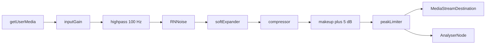
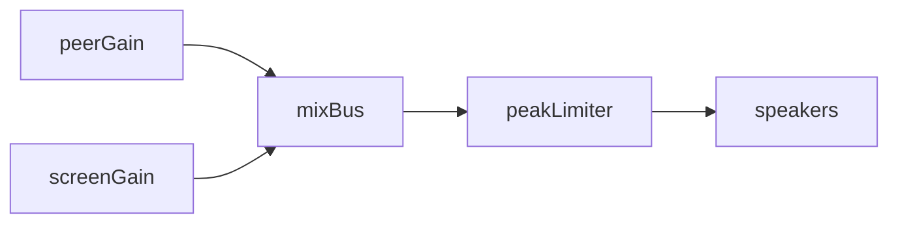

# Frontend noise suppression

Mic capture and remote playback dynamics. Session flow: [VOICE.md](./VOICE.md).

One noise suppressor on the mic. Browser `noiseSuppression` stays off so it does not stack on RNNoise. `echoCancellation` and `autoGainControl` stay on at capture. Constraints live in `get-stream.function.ts` (`channelCount: { ideal: 1 }`). If the browser rejects them, capture retries with looser constraints for the same device.

There is no settings UI. Thresholds are constants in `apps/frontend/src/app/core/audio/voice-dynamics.ts`.

## Capture

`MicrophoneService`, `AudioContext` at 48 kHz. `setGain` is the first node; the limiter is last, so that gain cannot clip the track sent to mediasoup.

| Stage                  | Role                                                                                                                                                                                     |
| ---------------------- | ---------------------------------------------------------------------------------------------------------------------------------------------------------------------------------------- |
| Highpass 100 Hz, Q 0.7 | Desk rumble before the model                                                                                                                                                             |
| RNNoise                | Non-stationary noise, including keyboard clicks under speech. Wasm from `@sapphi-red/web-noise-suppressor` (`assets/web-noise-suppressor`)                                               |
| Expander               | Closes pauses. Adaptive noise floor over ~2 s (eight 250 ms windows): opens near floor + 14 dB, closes near floor + 8 dB, hold 150 ms, attack 5 ms, release 120 ms, max cut about −40 dB |
| Compressor             | Gentle level ride: threshold −26 dB, knee 16 dB, ratio 2.5, attack 12 ms, release 250 ms                                                                                                 |
| Makeup +5 dB           | Lifts speech the compressor did not touch                                                                                                                                                |
| Limiter                | Lookahead 128 samples (~2.7 ms) tracked with a sliding maximum, ceiling −1 dBFS, release 50 ms                                                                                           |

The expander does not remove clicks while someone is talking; those stay above the open threshold. RNNoise is what attenuates them. The analyser sits on the limiter output (the signal that is actually sent) so the speaking indicator follows the gated track. `AudioActivityService` thresholds are unchanged.

Added latency is about one RNNoise frame (10 ms) plus the limiter lookahead. `cleanupPipeline` calls `destroy()` on the denoiser node and posts `{ type: 'dispose' }` to the expander and limiter. `process()` then returns false, so those processors stop while the capture context is still open (device change, pipeline rebuild).

**Fallback.** RNNoise needs 48 kHz. Any other `AudioContext` rate, or a failed wasm/worklet load, keeps Speex and the call stays up. If `audio/voice-dynamics.worklet.js` fails to load, expander and limiter are skipped and makeup stays at unity so the boost cannot clip.

## Playback

Loud remote audio and per-peer gain above 1 clip in the speakers. Several peers near full scale also clip when summed. `SpeakerService` keeps one mix bus and one limiter for the life of the speaker context. `getContext()` does not wait for the worklet. `getOutput()` loads it, and stops waiting after 2 s so a hung script cannot block playback. A failed load is not remembered: the next `getOutput()` tries again. Until the limiter attaches, the bus goes straight to the speakers. `PeerPlaybackService` and `PeerScreenAudioService` connect each gain into that bus: `gain → mixBus → peakLimiter → destination`. Detach disconnects only that peer. The speaking-indicator analyser stays on the peer gain, before the bus. Already-clipped audio from the sender cannot be repaired.

The worklet is a classic script in `apps/frontend/public/audio/voice-dynamics.worklet.js` (`konvoez/voice-dynamics`), loaded with `audioWorklet.addModule` as `audio/voice-dynamics.worklet.js?v=<app version>`. Nginx caches every `.js` and `.wasm` as immutable for a year, and these files have no content hash, so the query is the cache buster. RNNoise and Speex use `?v=<package version>` on the same rule. The app version comes from the repo `package.json` at bundle time; the suppressor version comes from `@sapphi-red/web-noise-suppressor`. Capture uses two nodes of that processor so the `DynamicsCompressorNode` can sit between the expander and the limiter. Playback uses the limiter node only. The stock `NoiseGateWorkletNode` is not used: it hard-mutes a 128-sample block and clicks on word edges.

## Tests

`microphone.service.spec.ts` (graph and Speex fallback), `get-stream.function.spec.ts`, `voice-dynamics.worklet.spec.ts` (quiet noise stays down, speech passes, full-scale peaks stay under the ceiling), `peer-playback.service.spec.ts`, `peer-screen-audio.service.spec.ts`.
