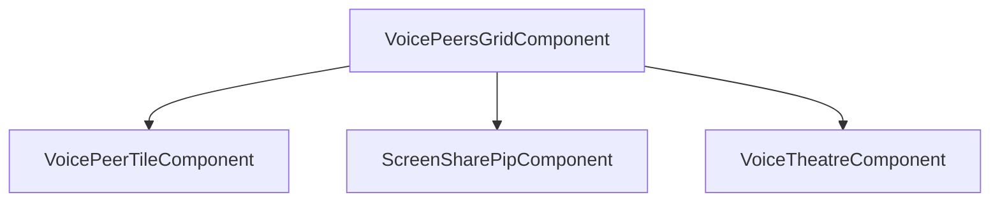

# Frontend streaming (camera & screen)

Camera and screen share on top of the voice stack described in [VOICE.md](./VOICE.md). Product decisions and completed phases are summarized in [konvoez-streaming-plan.ru.md](../../konvoez-streaming-plan.ru.md) (Russian).

## Limits and subscribe model

| Kind                             | Produce                 | Remote subscribe                         | Audio path                                                                        |
| -------------------------------- | ----------------------- | ---------------------------------------- | --------------------------------------------------------------------------------- |
| Microphone                       | Always while in session | Auto (`CONSUME` on `produce`)            | `PeerPlaybackService` (mic graph)                                                 |
| Camera                           | User toggles            | Auto                                     | Video: `PeerVideoService` → tile `<video>`                                        |
| Screen (+ optional screen-audio) | User toggles            | **Opt-in** («Watch» / `watchPeerScreen`) | Video: `PeerVideoService`; screen-audio: `PeerScreenAudioService` (separate gain) |

- At most **one cam + one screen** (+ screen-audio tied to screen) per user.
- Room cap: **≤4** video producers (`cam` + `screen` total); backend returns room-full error.
- Sender MVP codec: **VP8** (router advertises VP8/H264/VP9/AV1; no server-side transcode).

## Services

| Service                                  | Role                                                                                                                                                         |
| ---------------------------------------- | ------------------------------------------------------------------------------------------------------------------------------------------------------------ |
| `MediasoupSessionService`                | Produce/consume cam, screen, screen-audio; register available screen producers; `CLOSE_CONSUMER` / `CONSUMER_CLOSED` teardown                                |
| `PeerVideoService`                       | Remote/local **video** tracks for UI (`Record<userId, …>`); `watchingUserIds` (`Set`); `remoteTracks` computed (screen over cam when screen consumer exists) |
| `PeerScreenAudioService`                 | Screen-audio consumers and gain (not mixed into mic playback graph)                                                                                          |
| `CameraService` / `ScreenCaptureService` | `getUserMedia` / `getDisplayMedia`, height & FPS from local settings                                                                                         |
| `VoiceSessionService`                    | `watchPeerScreen` / `stopWatchingPeerScreen`; socket handlers that call into mediasoup + `PeerVideoService`                                                  |

`VoiceRoomStore` holds **per-peer mic gain** (`peerGainLevels`) and **per-peer screen-audio gain** (`peerScreenGainLevels`) — independent sliders in UI.

Local stream quality (`cameraHeight`, `cameraFps`, `screenHeight`, `screenFps`) lives in local settings; height/FPS pickers appear only in **start** dialogs, not in the main device settings panel.

## Display rules

- **Local user tile:** camera only (`PeerVideoService.localCamTrack`). Own screen preview is **not** in the grid tile.
- **Local screen:** floating PiP (`ScreenSharePipComponent`, bottom-left). Preview rendering can pause after 5s when the tab is hidden or the window loses focus (`screenPreviewAutoPauseWhenHidden` in local settings); user resumes manually. Producing to peers is unaffected.
- **Remote tile:** camera until the viewer clicks Watch; then screen track replaces video in the tile. **LIVE** badge when a screen is available before watch.

## UI layout

- **Grid:** peers split into a larger **streaming** section (cam and/or screen available) and a compact **voice-only** section (`partitionVoicePeers` in `voice-peers-layout.ts`).
- **Theatre:** local-only focus on a **watched** remote screen; participant strip (bottom or right by container vs stream aspect); fullscreen on stage; stop-watch + screen volume on hover/touch overlay. Opening theatre **unmounts** the grid (`@if`) so hidden tiles do not decode video.
- **Controls:** stream row on tile (watch / stop / theatre / screen volume); theatre entry also via click on video when watching.

Shared components: `apps/frontend/src/app/shared/components/voice-room/`.

## Lifecycle

On leave, producer close, or consumer close, mediasoup session code must clear **cam, screen, and screen-audio** graphs and `PeerVideoService` / `PeerScreenAudioService` state. Screen watch state is cleared when the screen producer goes away or the user stops watching.

## Platform notes

- `playsinline` on preview `<video>` elements.
- Screen share button hidden on iOS (capture not supported in MVP).
- Electron / desktop capture: separate follow-up (see plan).

## Tests (representative)

- `peer-video.service.spec.ts` — local cam vs screen, watch, available screen registry
- `voice-peers-layout.spec.ts` — grid partition, theatre strip placement (16:9 vs ultrawide)
- `screen-share-pip.component.spec.ts` — pause debounce, settings opt-out
- `voice-peers-grid.component.spec.ts` / `voice-theatre.component.spec.ts` — theatre open/close, grid unmount

Manual checklist (from streaming plan): two clients cam+screen; watch only after click; leave cleans screen-audio; Safari cam; theatre layouts.
