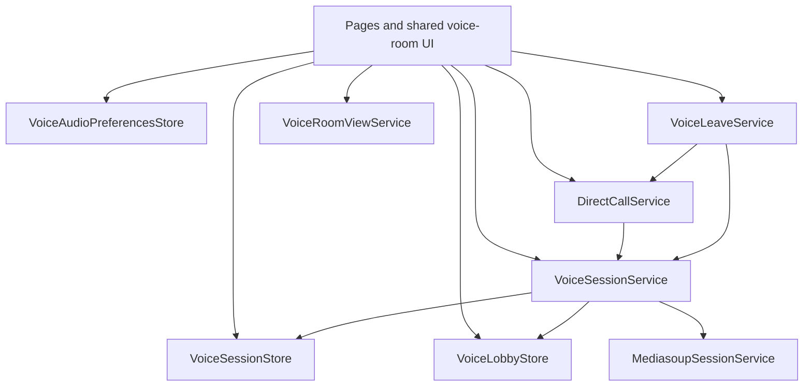

# Frontend voice

Group voice rooms and direct calls share one media stack. Signaling and SFU: [NETWORKING.md](../NETWORKING.md). Camera/screen: [STREAMING.md](./STREAMING.md). Mic dynamics: [NOISE_SUPPRESSION.md](./NOISE_SUPPRESSION.md).

## Layers

Signal stores hold session, lobby presence, and audio prefs. Sockets, mediasoup, and device pipelines live in services (no `Device` / `Transport` / `AudioNode` in stores).

- **Hangup:** `VoiceLeaveService.leaveActiveVoice()` — direct call via `DirectCallService.leaveCall()`, else `VoiceSessionService.leaveSession()`. `VoiceSessionService` does not import `DirectCallService`; switching sessions uses `sessionWillChange$` and `detachFromCallWithoutHangup()`.
- **Audio contexts:** capture, playback, and UI SFX are separate; resume after gesture is centralized in `AudioContextResumeService`.

## Flow (short)

1. **Join** — `VoiceSessionService.joinSession` (`GROUP_ROOM` or `DIRECT_CALL`) from room UI, effects, or `DirectCallService`. `JOIN_ROOM` uses `emitVoiceRoomWithAck` with a 10 s timeout; other ack-based voice events use the same helper with the default 5 s timeout and `{ error }` handling. While a join is in flight, `VoiceSessionStore.joiningTarget` is set (used by UI and by `canProduce`). Join/leave SFX, transports, mic produce, wake lock; reconnect rejoins stored session. Lobby peers: `EntitySyncService` loads an initial `GET_ALL_PEERS` snapshot when the voice socket connects (with ack timeout + retry), then applies `VOICE_ROOM_PEER_JOINED` / `VOICE_ROOM_PEER_LEFT` from entity-sync (`VoiceLobbyStore`; direct calls excluded). Events carry the server `epoch` + monotonic `revision`; a gap, an epoch change, or a reconnect of either the voice or the entity-sync socket triggers a (serialized) snapshot resync, and events are buffered while the lobby is unsynced. On each snapshot, buffered events from another epoch (or at or below the snapshot revision) are dropped so a server restart cannot poison the buffer. Deleting a group room emits `ROOM_CLOSED` on the voice socket to participants (then server eviction and lobby revision); the client leaves the session, shows a toast, and `RoomNavigationService` sends the user home when they are on `/voice-room/:id` for that room. Clients also resync the lobby on tab visibility, `online`, and a 60 s timer while visible.
2. **Mic** — `MicrophoneService` pipeline; mute via producer track + `VoiceAudioPreferencesStore`.
3. **Remote audio** — consume → `PeerPlaybackService` (deafen × per-peer gain).
4. **Speaking** — `AudioActivityService` polls registered analysers for tiles/avatars. `VoiceSessionService` registers the local analyser from `MicrophoneService` for the current user when there is an active session, an analyser exists, and `VoiceAudioPreferencesStore` reports the mic unmuted (mute state only comes from the prefs store).
5. **Direct calls** — signaling in `DirectCallService`; UI on `/direct/:id` (`DirectComponent` + `app-voice-room-shell`) and sidebar (`voice-room-panel`, hanging call in rooms aside). Shared grid/overlay: `shared/components/voice-room/`.

## Ownership

| Concern                                  | Owner                                          |
| ---------------------------------------- | ---------------------------------------------- |
| Active session + session peers           | `VoiceSessionStore`                            |
| Who is in which group voice room         | `VoiceLobbyStore`                              |
| Mute, deafen, peer / screen-audio gain   | `VoiceAudioPreferencesStore`                   |
| Join / leave media                       | `VoiceSessionService`                          |
| Call signaling, `callWithUserId`, rejoin | `DirectCallService`                            |
| Hangup button                            | `VoiceLeaveService`                            |
| Device changes in settings               | `AUDIO_DEVICE_HANDLER` → `VoiceSessionService` |
| Theatre, chrome, fullscreen              | `VoiceRoomViewService`                         |
| Grid peer list                           | `VoiceSessionPeersService`                     |

## Code map

- Stores: `apps/frontend/src/app/core/voice/`
- Session / mediasoup / devices: `apps/frontend/src/app/core/services/voice-*.ts`, `mediasoup-session.service.ts`, `peer-*.service.ts`, `direct-call.service.ts`, `voice-leave.service.ts`
- Shared UI: `apps/frontend/src/app/shared/components/voice-room/`
- Routes: `features/voice-room/`, `features/direct/`
