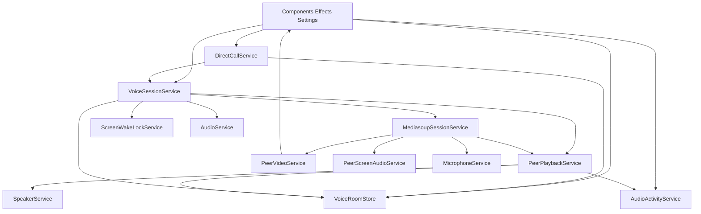

# Frontend voice flow

Client-side voice for group rooms and direct calls. Signaling and SFU networking are in [NETWORKING.md](../NETWORKING.md). Camera and screen sharing are documented in [STREAMING.md](./STREAMING.md).

## Architecture

Domain state lives in a signal store. Sockets, mediasoup, and device pipelines live in services. The store does not hold `Device`, `Transport`, or `AudioNode` instances.

Hangup from UI goes through `VoiceLeaveService`: if a direct call is active it calls `DirectCallService.leaveCall()`, otherwise `VoiceSessionService.leaveSession()`. `VoiceSessionService` does not depend on `DirectCallService`. Switching away from a live call is handled by `DirectCallService` on `sessionWillChange$` (`detachFromCallWithoutHangup()`).

Capture, playback, and UI SFX each use their own `AudioContext`. Auto-resume after a user gesture is centralized in `AudioContextResumeService`.

## Runtime path

1. **Session.** UI, `RoomsEffects`, or `DirectCallService` call `VoiceSessionService.joinSession` (`GROUP_ROOM` or `DIRECT_CALL`). Join: join SFX, emit `sessionWillChange$`, leave the previous session if any, `JOIN_ROOM`, load Device, send/recv transports, produce mic, screen wake lock. Leave reverses that and releases the mic. Socket `connect` cleans mediasoup and rejoins the stored session; lobby peers are polled with `GET_ALL_PEERS` every 10s.

2. **Capture.** `MicrophoneService`: `source → gain → highpass → Speex → analyser + MediaStreamDestination`. Mute is `producer.track.enabled`. Changing the input device closes and replaces the producer. A `devicechange` after the first mic permission does not rebuild capture (iOS fires that event without a hardware change); produce waits until the track unmutes, and an ended producer track is replaced.

3. **Playback.** On remote produce: `CONSUME`, dummy muted `<audio>` (Chrome), then `source → gain → analyser + destination`. Gain is speaker-mute (deafen) times per-peer volume. Graphs are keyed by user id in `PeerPlaybackService`, not on peer entities.

4. **Speaking.** `AudioActivityService` polls registered analysers (~50ms). Local user is registered from a `VoiceRoomStore` hook when there is an active session, a live mic analyser, and the mic is unmuted.

5. **Video.** Cam produces/consumes through `MediasoupSessionService` into `PeerVideoService`; screen is opt-in watch via `VoiceSessionService.watchPeerScreen`. Screen-audio uses `PeerScreenAudioService` with separate per-peer gain in the store. UI: `voice-peers-grid`, PiP, theatre — see [STREAMING.md](./STREAMING.md).

6. **Lobby.** `roomsState` is the sidebar map of who is in which **group** voice room (direct calls are excluded). Updated on connect, poll, join/leave, and peer join/leave; user entity sync patches both lobby and session peers.

## UI contract

| Concern                                       | Owner                                                      |
| --------------------------------------------- | ---------------------------------------------------------- |
| Session, lobby, peers (`IUser[]`), mute, gain | `VoiceRoomStore`                                           |
| `joinSession` / `leaveSession`                | `VoiceSessionService`                                      |
| Hangup / leave button                         | `VoiceLeaveService.leaveActiveVoice()`                     |
| Settings input/output devices                 | `AUDIO_DEVICE_HANDLER` → `VoiceSessionService`             |
| Speaking indicator                            | `AudioActivityService.speakingMap`                         |
| Cam / screen tracks, watch set                | `PeerVideoService`                                         |
| Screen-audio playback                         | `PeerScreenAudioService`                                   |
| Watch / stop screen                           | `VoiceSessionService`                                      |
| Mic vs screen-audio volume                    | `VoiceRoomStore` `peerGainLevels` / `peerScreenGainLevels` |

## Main files

- Store: `apps/frontend/src/app/features/voice-room/voice-room.store.ts`
- Session / mediasoup / playback / video / wake lock / leave: `apps/frontend/src/app/core/services/voice-*.ts`, `mediasoup-session.service.ts`, `peer-playback.service.ts`, `peer-video.service.ts`, `peer-screen-audio.service.ts`, `camera.service.ts`, `screen-capture.service.ts`, `screen-wake-lock.service.ts`
- Capture / sink / VAD / SFX: `microphone.service.ts`, `speaker.service.ts`, `audio-activity.service.ts`, `audio.service.ts`, `audio-context-resume.service.ts`
- Call signaling: `direct-call.service.ts`
- Shared UI: `apps/frontend/src/app/shared/components/voice-room/`
